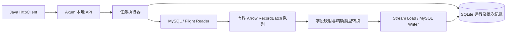

# 内核结构

| 模块 | 责任 |
|---|---|
| `config` | 严格配置反序列化、默认值、参数互斥及资源限制，生成 JSON Schema |
| `api` | 本地任务 API、结构预检、OpenAPI |
| `engine` | 任务准入、超时、取消传播、内存预约、限速、worker 收尾 |
| `types` | Arrow 类型、MySQL 行到 builder、精确转换、目标字段映射 |
| `connectors/mysql` | 二进制流式读、目标元数据、前后置 SQL、参数化批次事务 |
| `connectors/doris` | Flight 所有 endpoints、Doris 原生类型适配、IPC Stream Load、label 核实 |
| `store` | SQLite WAL/FULL、幂等请求、批次意图与确认、进程锁、重启中断标识 |

扩展新数据库时实现 `Reader` 和 `Writer` trait，并注册配置、目标元数据与类型兼容规则。Reader 输出 Schema/RecordBatch，Writer 消费已按目标规则转换的 RecordBatch；任务执行器不认识数据库行对象。

运行时先预检，再执行 pre_sql、复核目标、并发读写、等待所有提交确认，最后执行 post_sql。Writer 发起提交前必须成功写入 SQLite INTENT；数据库提交后的凭据与进度在本地事务内一起保存。两者无法构成跨系统事务，因此明确暴露 commit_unknown。

MySQL 目标元数据来自 information_schema；Doris 额外使用 SHOW FULL COLUMNS 读取原生类型。Doris 的兼容元数据会把 BOOLEAN 显示为 tinyint(1)，直接据此构造 Arrow Int8 会违反其 Stream Load Reader 的物理类型要求。LARGEINT 的字符串协议表示同样在连接器边界做专门处理。

每任务内存预算分为 Reader 和待写队列两个池；每个批次在复制、映射和编码之前取得预算，消费完成后释放。队列满或预算不足时 Reader 等待；取消会解除等待，已发出的写入仍完成确认流程。驱动、分配器、TLS、SQLite 不等同于受控数据缓冲，因此该预算不作为操作系统 RSS 上限。
