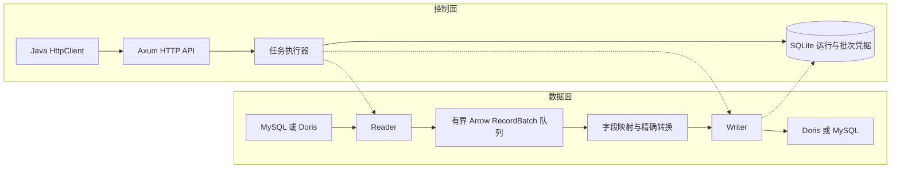

# Dunnelean 原理与 DataX、SeaTunnel 对比

本文面向开发人员和架构评审，说明 Dunnelean 如何完成 MySQL 与 Doris 之间的离线批量同步，以及它与 DataX、SeaTunnel 的设计共通点和取舍。Dunnelean 的定位是把这条特定同步链路做成可由 Java 控制的本地服务：使用 Arrow 承载批次数据，约束缓冲资源，并明确记录数据库提交结果。

说明以当前 Dunnelean 0.1.0 源码和已有验收记录为准。DataX 以开源 3.0 框架及所引用的 DorisWriter 实现为比较对象；SeaTunnel 以官方 2.3.13 文档为依据。外部资料核对日期为 2026-09-30。“吸取”指设计上的共通与取舍，不表示已经证实开发历史、代码继承关系或性能领先。

## 一、Dunnelean 的原理

### 1.1 项目定位与整体架构

Dunnelean 使用 Rust、Tokio 和 Apache Arrow 实现，当前仅支持 MySQL → Doris、Doris → MySQL 两个方向。它按来源表或查询结果执行一次有界批量同步，不订阅 binlog，也不持续传播后续变更。服务默认监听 `127.0.0.1:9876`；目标表需要预先存在。

系统分为控制面和数据面。控制面接收配置、管理任务准入与生命周期、保存状态；数据面读取数据库、构造批次、映射字段并写入目标。Java 只使用 HTTP 提交配置和查询结果，业务数据不经过 Java 客户端，因此客户端无需 Arrow 或 JDBC 依赖。



这里的 Reader、Writer 是内部接口，分别负责输出和消费 `RecordBatch`；执行器负责背压、并发和收尾，不处理数据库驱动的行对象。图中 Writer 到 SQLite 的虚线表示执行器保存写入结果，Writer 接口本身不访问状态库。新增连接器仍需修改配置枚举、注册代码和类型规则，再重新编译；当前接口抽象不等于运行时插件加载。实现见[连接器接口](../src/connectors/mod.rs)和[任务执行器](../src/engine.rs)。

### 1.2 一次任务如何执行

调用方先提交 reader、writer、mapping 和 execution 配置。服务检查未知字段、互斥参数、资源限制和同步方向，然后准入并建立运行记录。数据库连接及 schema 预检在实际执行阶段完成，也可提前调用 `POST /v1/validate`。收到运行 ID 只表示任务已被接受，不表示已经同步成功。

任务依次执行：来源与目标预检 → Writer 的 `pre_sql` → 重新读取目标元数据并规划映射 → 并发流式读写 → 等待全部批次确认及 worker 退出 → Writer 的 `post_sql` → 成功终态。前置 SQL 可能改变目标结构，所以必须复核；实际读取若发现来源列名或类型改变，也会停止。缺失必填目标列、写入生成列或不兼容映射，在预检阶段拒绝；数值溢出等内容问题只能在批次转换时发现。

任务状态包括 `QUEUED`、`RUNNING`、`CANCELLING` 和终态 `SUCCEEDED`、`FAILED`、`CANCELLED`、`INTERRUPTED`。调用方还应读取 `rows_committed`、`partial_write`、`commit_unknown` 等字段，判断失败是否已经产生部分写入。配置和接口细节见[参数手册](parameters.md)。

### 1.3 MySQL → Doris：二进制读取与 Arrow 导入

```text
MySQL prepared query / binary protocol
  → 驱动值追加到 Arrow 列 builder
  → RecordBatch → 有界队列 → 字段映射和类型校验
  → 完整 Arrow IPC Stream → Doris Stream Load
```

MySQL Reader 通过参数化查询流式消费结果。驱动仍返回行对象，但每行会立即追加到对应类型的列 builder，随后组成 Arrow 批次，不在执行器中长期保存整表或逐行中间对象。Reader 批次进入队列前，还会按 Writer 的行数和字节阈值重新切分。

Doris Writer 将转换后的批次编码成完整的 Arrow IPC **Stream**，通过 HTTP Stream Load 导入，每个提交批次使用独立 label。这样避免了这一写入路径中的 CSV 分隔、JSON 转义和逐值文本解析，但仍需 IPC 编码及网络传输。

目标类型必须按 Doris 原生元数据识别。例如其 MySQL 兼容元数据可能把 BOOLEAN 显示为 `tinyint(1)`，目标校验会额外读取原生列类型，防止误用 Arrow Int8。LARGEINT 在 Flight/Stream Load 边界采用带类型元数据的字符串表示，内部统一成 `Decimal256(39,0)`，写出时验证 i128 范围并恢复协议表示。这些处理属于 Doris 连接器适配，不能仅凭“都支持 Arrow”省略。[Doris Flight SQL](https://doris.apache.org/docs/4.x/connection-integration/arrow-flight-sql/)、[Stream Load](https://doris.apache.org/docs/4.x/data-operate/import/import-way/stream-load-manual/)

### 1.4 Doris → MySQL：Flight 批次与多行事务写入

```text
Doris Flight SQL 查询 → 消费全部 Flight endpoints
  → 解码并标准化 RecordBatch → 有界队列 → 字段映射
  → prepared multi-row INSERT / upsert → MySQL 批次事务
```

Doris Reader 发起一次业务查询，取得 Flight 返回的全部 endpoints，再按配置并行消费其批次，不通过重复执行 `LIMIT/OFFSET` 拼接数据集。分块时会复制切片，避免很小的排队批次一直持有整个较大的 Flight 消息；这也是管道并非端到端零拷贝的一个原因。

Doris 官方仍将 Flight SQL 标为实验功能，当前项目固定以 4.1.4 验收。更换版本或集群拓扑时，应重新验证类型表示、endpoint 可达性和导入协议兼容性。[Doris Flight SQL 说明](https://doris.apache.org/docs/4.x/connection-integration/arrow-flight-sql/)

MySQL Writer 把 Arrow 列转换为驱动参数，生成真正的多行 prepared INSERT。单个批次使用独立 InnoDB 事务；当遇到 65,535 个参数或 packet 大小限制时，拆成多个语句，但保持在同一批事务内提交。upsert 使用目标键和更新列配置，其 `affected rows` 可能是 0、1 或 2，因此 `rows_committed` 统计已确认提交的输入行数，数据库影响行数单独放在 `server_affected_rows`。

### 1.5 Arrow 与精确类型转换

Arrow `Schema` 描述列名、类型和可空性；`RecordBatch` 将同一批数据按列组织，用有效性位图表达 NULL。其价值是让连接器之间共享一种有类型的批次表示。JSON 用于配置、状态和响应，不作为同步管道的行数据载体；来源中的 JSON 列仍可作为 Utf8 数据同步。

类型转换遵循“目标可精确表示才接受”的原则，而不是自动格式化后交给目标猜测。典型规则如下，实现见[类型与映射代码](../src/types.rs)。

| 数据 | 内部处理与边界 |
| --- | --- |
| 大整数 | 保留 Int/UInt；UInt64 不经 i64 或浮点中转，目标范围不足则失败 |
| DECIMAL | 精度 ≤ 38 用 Decimal128，更高精度用 Decimal256；缩小 scale 时只允许移除全零尾数，不舍入 |
| 日期时间 | DATE 用 Date32；DATETIME 保留无时区墙上时间；TIMESTAMP 标准化为 UTC，在数据库边界按固定会话偏移换算 |
| NULL | 保留 SQL NULL，不等同于空串、0 或 JSON 文本中的 null；写入非空目标时校验实际批次 |
| 二进制与 TIME | Binary 不做有损 UTF-8 解码；MySQL TIME 用有符号微秒时长，保留负值和超过 24 小时的值 |

例如目标 precision 足够且 scale 为 2 时，`123.4500` 可以精确写入，而 `123.4567` 会失败；目标只能保留毫秒时，不能静默丢掉非零微秒。MySQL TIME/BLOB 或 Doris ARRAY/MAP/STRUCT 没有兼容目标时，调用方需在来源 SQL 中明确转换。更完整的类型和时区约定见[运行语义](semantics.md)。

### 1.6 资源约束、背压与并行

数据量增长时，系统循环处理并释放批次，而不是累积完整数据集。默认批次阈值为 10,000 行或 16 MiB，先到者封批；单行可超过批次软阈值，但仍受单行硬上限和内存预约约束。默认队列最多容纳 4 个待写批次。

`memory_bytes` 默认 256 MiB，一半用于 Reader 工作缓冲，一半用于排队、转换和编码。相关缓冲先预约资源、消费后释放；Writer 慢导致队列满或预算不足时，Reader 等待，形成背压。分池避免 Reader 占满预算而 Writer 无法继续处理；行数与估算字节数限速则用于控制任务对数据库的持续压力。

该预算不是操作系统 RSS 上限，驱动、TLS、SQLite、分配器及其他运行时开销仍需内存。多个任务也各有自己的预算，需结合服务 `max_running` 评估总资源。MySQL 默认 `snapshot` 模式在单连接上使用只读 REPEATABLE READ 一致性快照，这一保证依赖 InnoDB 等事务型表。并行度方面，MySQL 支持整数范围分片，Doris 支持 endpoint 并行，Writer 支持多个消费者；但多个 MySQL 分片连接各自建立快照，不构成共同时间点快照，并发也不保证全局行序。依赖重复键“最后一条覆盖”的作业，应使用单 Reader、单 Writer 和显式排序查询。

### 1.7 批次确认、幂等和取消

SQLite 使用 WAL 与 `synchronous=FULL` 保存运行及批次记录。每次写入前先保存 `INTENT`；数据库明确确认后，在一个本地事务中保存凭据和累计进度。批次结果区分 `CONFIRMED`、`NOT_COMMITTED`、`UNKNOWN`，可通过 `/v1/runs/{id}/batches` 查询。数据库与 SQLite 无法组成跨系统原子事务，因此凭据让结果可核查，但没有消除提交不确定性。

假设一个批次包含 10,000 行，目标数据库已提交，随后网络中断，客户端未收到响应。直接重传可能造成重复追加；直接认为未写入又可能漏记结果。Dunnelean 分别处理两类目标：

- **MySQL**：COMMIT 响应丢失后，不自动重放，任务标记 `FAILED`、`commit_unknown=true`。已确认回滚且属于可重试的死锁或锁等待错误，才允许有界重试。
- **Doris**：遇到响应丢失、Publish Timeout 或重复 label，先查询 FE 的 label 状态；VISIBLE 可按确认规则结算，PREPARE/COMMITTED 有界等待，明确 ABORTED 才复用原 label、原 payload 重试。UNKNOWN 或无法核实则暴露不确定状态。允许过滤时若丢失了行数凭据，仅有 VISIBLE 也不足以结算准确计数。

即使数据库已确认成功，若 SQLite 保存凭据失败，也必须暴露不确定性，不能重放。任务在此前已经确认的批次会保留；没有全任务事务，前后置 SQL 的副作用也不会自动补偿。

`request_id` 解决另一层问题：同 ID、同完整配置返回原运行，不同配置返回 409；已结束的运行不会因重复提交而重新执行。它用于处理 HTTP 提交重试，不是业务去重键。协调器还可使用持久化取消记录和 `state_store_id` 识别迟到提交、状态库更换，具体见[可靠控制协议](studio-control.md)。

取消和任务超时都采用收尾流程：Reader 停止继续读取，Writer 不开始新批次，已经发出的提交仍等待结果或超时；所有 worker 退出后才写终态。取消不撤销已提交数据。进程重启将遗留非终态任务标为 `INTERRUPTED`，未结清 INTENT 视为提交结果未知，不自动续传。Doris label 还受数据库保留期限制，不能当作无限期恢复依据。

## 二、与 DataX、SeaTunnel 相比，吸取的优势与补齐的问题

### 2.1 能力对照与比较口径

三者的目标不同：DataX 提供通用离线异构同步框架，SeaTunnel 覆盖批处理、实时同步和多种执行引擎，Dunnelean 聚焦本地 MySQL/Doris 链路。以下表格比较框架及选定连接器，不将某个插件的行为推广到全部生态。

| 维度 | DataX 开源 3.0 | SeaTunnel 2.3.13 | Dunnelean 0.1.0 |
| --- | --- | --- | --- |
| 运行形态 | JVM 单机多线程，按 Job 启动进程 | JVM；Zeta 可本地或集群运行，也可使用 Flink/Spark | Rust 常驻本地服务，单进程管理多个任务 |
| 内部表示 | 自定义 Record/Column | 统一 SeaTunnelRow 与类型、表元数据 | Arrow Schema/RecordBatch |
| Doris 写入路径 | 本文所选 DorisWriter 使用 CSV/JSON Stream Load | 由具体连接器和配置决定 | Arrow IPC Stream Load |
| 连接器与扩展 | 广泛的 Reader/Writer 插件 | 广泛的 Source/Transform/Sink 插件和引擎适配 | 仅 MySQL ↔ Doris；扩展需修改代码并编译 |
| 类型处理 | 框架类型、插件转换及脏数据策略 | 统一类型系统，具体兼容性依赖连接器 | 元数据预检与精确批次转换，明确拒绝不可表达值 |
| 资源控制 | 有界 Channel、并发及记录/字节限速 | split 并行、背压及引擎资源调度 | 批次阈值、有界队列、分池预算及任务限速 |
| 控制接口 | 本文所选核心以配置、进程和日志为主要入口 | Zeta 提供 REST API 和任务管理 | 本地 HTTP API、SQLite 状态、request_id 与批次凭据 |
| 故障处理 | 框架 TaskFailover 与插件重试，依赖目标写入语义 | checkpoint 恢复；端到端保证取决于源、目标及配置 | 运行内核实提交；不确定结果停止，不自动断点恢复 |

DataX 的依据为[官方介绍](https://github.com/alibaba/DataX/blob/master/introduction.md)、[MemoryChannel 源码](https://github.com/alibaba/DataX/blob/master/core/src/main/java/com/alibaba/datax/core/transport/channel/memory/MemoryChannel.java)及下文的 DorisWriter 文档。SeaTunnel 的依据为[架构说明](https://seatunnel.apache.org/docs/2.3.13/architecture/overview/)、[本地启动说明](https://seatunnel.apache.org/docs/2.3.13/getting-started/locally/quick-start-seatunnel-engine/)和 [Zeta REST API](https://seatunnel.apache.org/docs/2.3.13/engines/zeta/rest-api-v2/)。因此，背压、并发、流控和 HTTP 管理都不能被描述为 Dunnelean 独有的发明。

### 2.2 延续了哪些成熟设计

**Reader/Writer 解耦和配置驱动作业**延续了 DataX 的思路：连接器处理数据库差异，框架协调传输、流控与生命周期。Dunnelean 的配置同样把来源、目标和资源策略分开，Java 可以独立组织任务；差别在于内部数据单位改为 Arrow 批次，并将执行包装为常驻服务。

**并行读取、批量写入和受控缓冲**也是成熟同步框架的共同能力。Dunnelean 使用分片或 Flight endpoints 提供读取并行，用多行 INSERT、Stream Load 降低请求次数，再用有界队列隔离读写速度差异。这些机制的价值是让同步适配目标承载能力，并避免 Reader 持续堆积数据。

**统一连接器接口、类型契约和元数据检查**与 SeaTunnel 的 Source/Transform/Sink 分层方向一致。Dunnelean 将字段映射与精确转换放在数据库读写边界之间，使错误尽可能在写入前被发现。但它没有 SeaTunnel 的独立 Transform 插件体系、多引擎翻译层或 checkpoint 协调器；这里只延续职责划分，没有实现其完整运行架构。

### 2.3 在特定场景中补齐了什么

这里的“补齐”指减少本地 MySQL/Doris 集成中的具体成本和歧义，不表示其他框架普遍缺少这些能力。以下收益涉及本项目的设计判断；涉及性能时仍需同条件实测。

**减少所选 Doris 写入路径中的文本中转。** 问题：DataX [DorisWriter 官方文档](https://github.com/apache/doris/blob/master/extension/DataX/doriswriter/doc/doriswriter.md)描述将值转换为 CSV 或 JSON，再使用 Stream Load。实现：Dunnelean 使用有类型的 Arrow 批次与 IPC Stream。收益：这条链路无需 CSV 分隔和 JSON 转义，类型信息可以延续到 Doris 导入边界。代价：需维护 Doris 原生物理类型适配，并承担 Arrow/IPC 编解码成本；这不能证明文本导入必然丢失精度，也不能推广为所有 DataX 插件都使用文本。

**减少本地运行依赖与集成步骤。** 问题：即使只有两种数据库，通用工具仍需准备运行时、连接器及相应启动配置。实现：Dunnelean 以一个原生可执行服务提供固定链路和 HTTP 控制。收益：Java 调用侧只需标准 HttpClient，不必把同步驱动和数据搬运逻辑装入业务进程；原生运行避免了该进程的 JVM/GC。代价：通用性和生态覆盖显著收窄，部署仍需数据库协议与权限配置，当前实测平台只有 Windows。SeaTunnel 的 Zeta 可独立运行且支持 local 模式，不能说它必须依赖 Flink/Spark 或必须部署集群。

**明确高风险类型转换的失败条件。** 问题：跨数据库的无符号整数、DECIMAL 和时间语义不同，不能只按名称相近判断可写。实现：Dunnelean 同时校验元数据与实际值，拒绝非零精度损失、溢出和不兼容表示。收益：调用方能明确知道需要改 SQL、DDL 或时区配置，避免默默得到另一种数值含义。代价：部分数据需要显式投影，类型错误会停止任务；严格校验不等于没有部分写入。DataX、SeaTunnel 也有类型系统，区别是这里把选定链路的规则和失败契约固定并测试。

**让提交不确定性可查询。** 问题：进程失败和网络错误无法直接回答“目标到底写入了吗”。实现：先记 INTENT，再保存数据库凭据与进度；Doris 查询 label，MySQL COMMIT 丢响应时停止重放。收益：API 能区分已确认、未提交和未知，便于 Java 协调器决定是否需要核查，而不是只依赖退出码。代价：增加本地持久化开销，数据库与 SQLite 仍有双写间隙，遇到未知结果可能需要人工处理；这是可观测性和保守重试的改进，没有实现 SeaTunnel 的 checkpoint 恢复。

**补上本地服务与 Java 协调器之间的控制契约。** 问题：提交响应丢失、取消先于提交到达或状态库被替换时，仅凭运行 ID 不足以安全协调。实现：稳定 request_id、配置冲突检测、持久化取消记录和状态库身份校验。收益：重试能找回原运行，迟到提交可被拒绝，状态库变化可明确报告。代价：调用方必须保存 ID 和核查状态，重新执行要用新 ID；接口默认面向本机可信调用者，没有远程认证层。SeaTunnel 已有 REST 管理，Dunnelean 的收益在于上述本地协议和集成范围。

### 2.4 已有验收能证明什么

已有[验收记录](acceptance.md)覆盖双向同步、类型往返、背压，以及真实数据库提交后的响应丢失、取消和 SQLite 凭据保存失败。以下为该次验收的规模实测结果。

| 行数 | MySQL → Doris 用时 / 峰值 RSS | Doris → MySQL 用时 / 峰值 RSS |
| ---: | ---: | ---: |
| 1,000,000 | 4.453 秒 / 21.2 MiB | 7.719 秒 / 61.5 MiB |
| 10,000,000 | 42.453 秒 / 21.0 MiB | 73.312 秒 / 113.6 MiB |

测试于 2026-09-29 在 Windows Rust MSVC 程序、Docker Desktop Linux、16 CPU、约 14 GiB 容器内存环境执行，数据库为单 FE/BE Doris 4.1.4 和 MySQL 9.7.2。数据包含 BIGINT、DECIMAL(20,4) 和短 VARCHAR，使用默认单 Reader/Writer、10,000 行或 16 MiB 批次、队列 4、256 MiB 缓冲预算。

时间包含提交到轮询终态，不含建表和数据生成；RSS 约每 150 毫秒采样，只统计 Dunnelean 进程。结果支持“这些测试中不需要整表缓存”，不构成进程内存硬上限，也不代表宽行、生产集群或持续负载表现。没有同环境的 DataX/SeaTunnel 基准，不能据此宣称更快、更省内存。

### 2.5 当前缺口与适用场景

SeaTunnel 的 [checkpoint 机制](https://seatunnel.apache.org/docs/2.3.13/architecture/fault-tolerance/checkpoint-mechanism/)保存可恢复的源与执行状态；其 [JDBC Sink](https://seatunnel.apache.org/docs/2.3.13/connectors/sink/Jdbc/)可以在数据库支持 XA、启用相应配置并满足整个管道条件时提供 exactly-once。Dunnelean 的 SQLite 记录不保存可续传的源偏移、完整批次 payload 或一致执行快照，重启仅标记中断，所以既不等同于 checkpoint，也不应宣称端到端 exactly-once。

当前还缺少 CDC、分布式调度、自动断点恢复、自动目标建表和通用转换插件；upsert 不传播来源删除，也不会清除目标独有数据。分片快照不保证共同时间点，并发不保证全局顺序，失败或取消不提供全任务回滚。这些限制与较窄实现范围共同存在，不能用 request_id 或 Doris label 去重替代。

如果需求是现有 MySQL/Doris 之间的本地离线批量同步，由 Java 控制任务，且接受预建表、批次提交和未知结果核查，Dunnelean 提供了集中、明确的实现。需要更多数据源和成熟离线插件时，应评估 DataX；需要 CDC、多节点处理、多表同步或 checkpoint 自动恢复时，应优先评估 SeaTunnel 及其具体连接器。选型应按所需能力和验证范围决定，而不是仅凭语言或单次吞吐数字。
